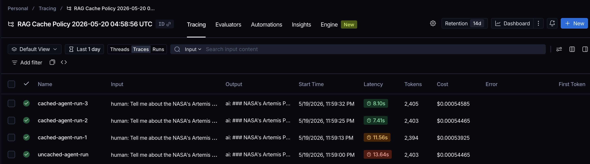
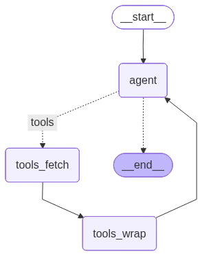
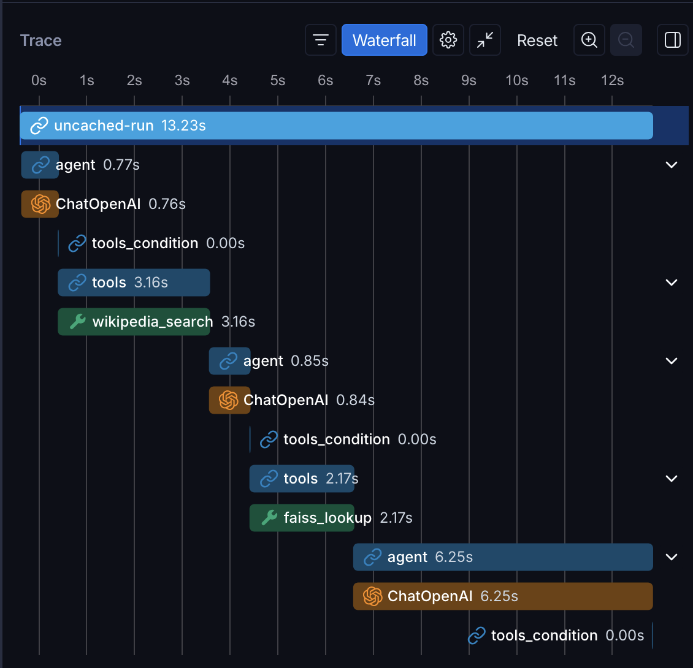
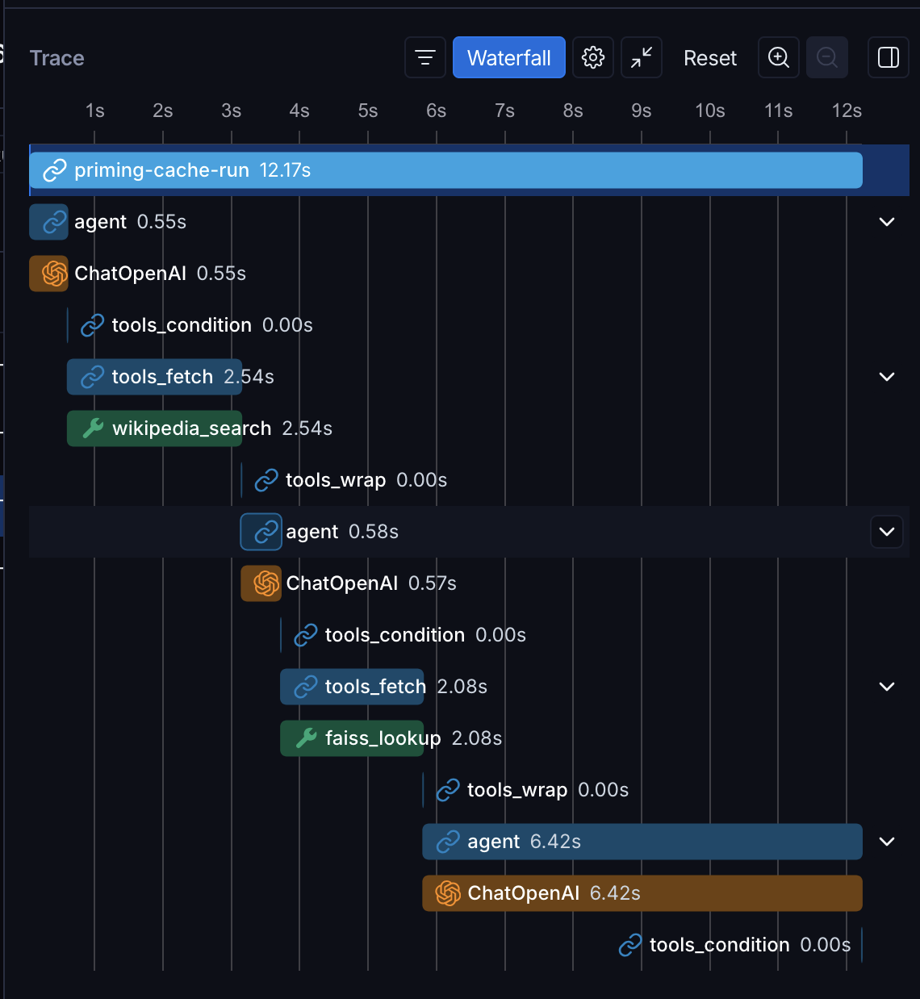
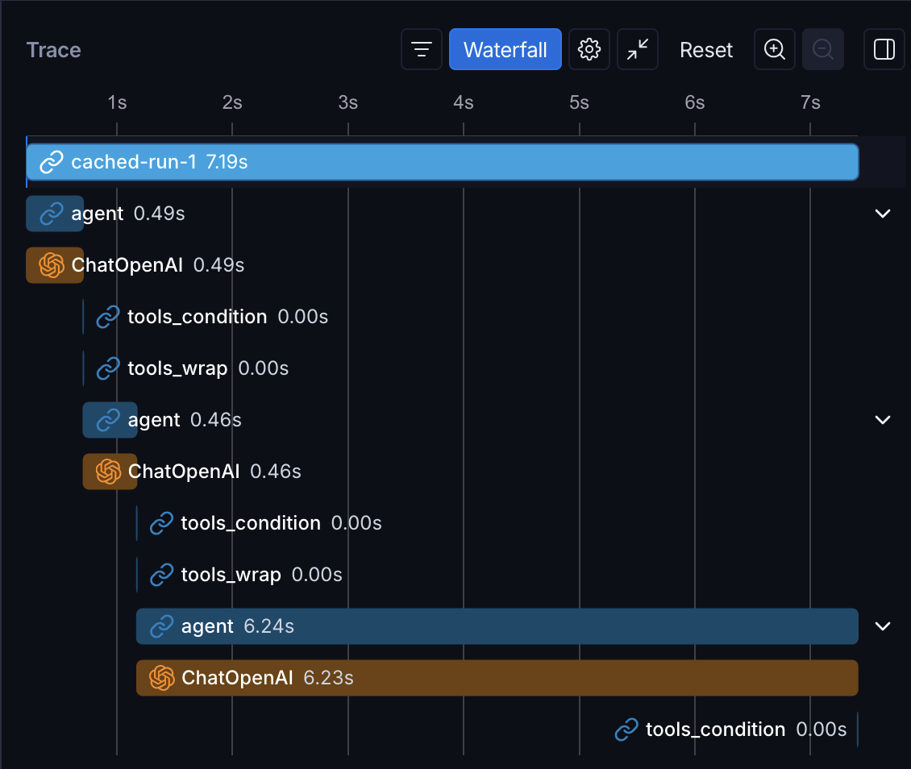
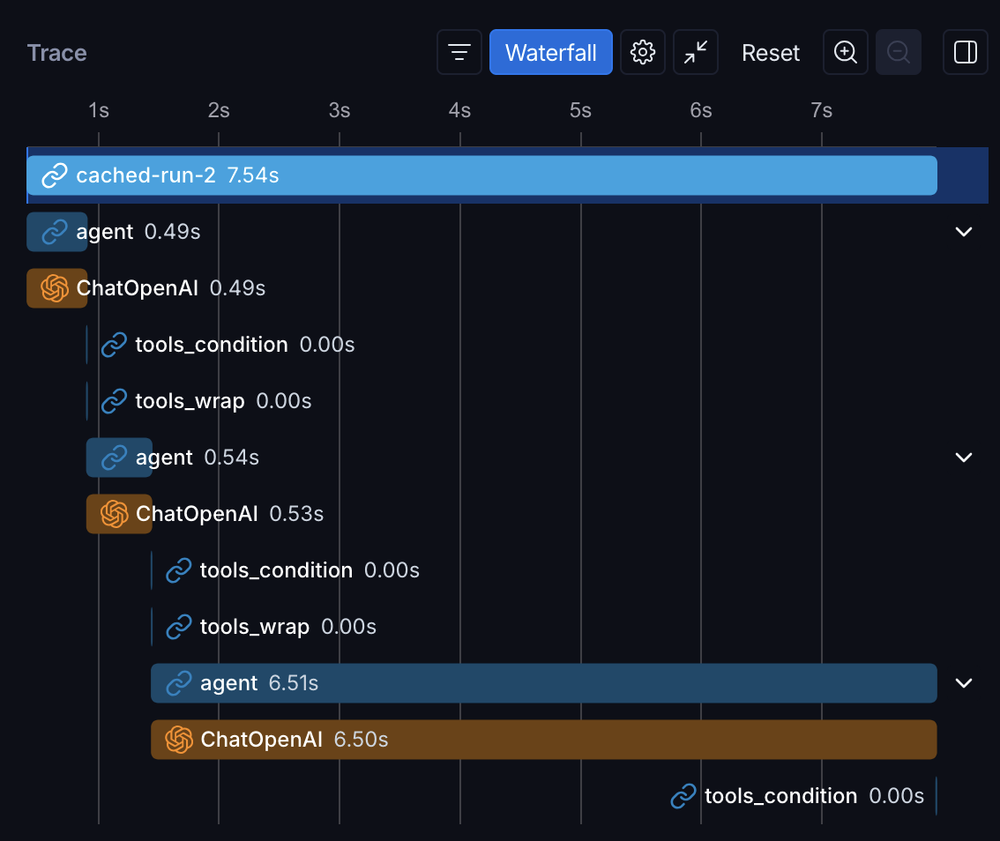

# LangGraph Cache-Aware RAG Agent: Cutting Agent Latency with `CachePolicy`

[](LICENSE)
[](https://www.python.org/downloads/)
[](https://github.com/astral-sh/uv)
[](https://colab.research.google.com/github/sheldonlsides/langgraph-cachepolicy-rag-agent/blob/main/src/cache_aware_rag.ipynb)

This repo shows how to cache a LangGraph agent's **tool calls** (not the LLM) with **`CachePolicy`**, for measurable latency reduction on repeat queries. The agent picks between two tools (a local FAISS index of the Apollo corpus and a live Wikipedia search), and we cache those tool calls on the `tools_fetch` node while deliberately leaving the LLM response uncached.

[Want to jump straight to the notebook?](./src/cache_aware_rag.ipynb)

## Results at a glance

Same agent, same question ("Tell me about the NASA's Artemis program and tell me about the Apollo program."). The only difference is whether `CachePolicy` is attached to the tool-fetch node. The numbers below are from one representative run. Your exact timings will vary with LLM API latency.

| Run                | Latency  | Tokens | Cost       |
| ------------------ | -------- | ------ | ---------- |
| Uncached           | 13.64 s  | 2,403  | $0.00054   |
| Cached (priming)   | 11.56 s  | 2,394  | $0.00054   |
| Cached (warm) #1   | 7.41 s   | 2,403  | $0.00054   |
| Cached (warm) #2   | 8.10 s   | 2,405  | $0.00055   |

**~46% latency reduction on the warm path. No change in tokens or cost. The LLM is deliberately uncached.** The savings come entirely from skipping repeated tool calls (FAISS lookup + Wikipedia round-trip).

[](src/images/lang_smith_project_run.png)

## Why this exists

Most agent tutorials show the happy path once and stop. In real use, many times the same agent gets hit with the same questions over and over: re-running a notebook cell to tweak a downstream prompt, A/B testing two system messages, or fielding the same handful of FAQ-style queries during demos. Without caching, every re-run pays full price for the slow operations, which in an agent means the **tool calls** such as live API round-trips, vector searches, third-party HTTP. The LLM is usually not the bottleneck. The tools are.

`CachePolicy` is the LangGraph primitive that fixes this, but it is easy to misuse. If you cache the LLM you freeze the model's generation across calls. Use the wrong `key_func` and identical tool calls miss the cache because the conversation history kept growing. Allow parallel tool calls and you get order-sensitive cache keys that silently destroy your cache hit rate. This repo is an end-to-end example of how to set up cache policies in LangGraph.

## What you'll learn

- How to build a ReAct-style agent in LangGraph with `MessagesState`, a custom `agent` node, and the prebuilt `ToolNode`.
- Why tool calls are the right thing to cache (and the LLM is not), and which LangGraph node to attach `CachePolicy` to.
- How to write a `CachePolicy(ttl=3600, key_func=...)` that hashes only on the pending tool call's `(name, args)`, so repeated tool calls hit the cache regardless of conversation length.
- How to measure the latency improvements: warm vs. cold latency, and answer similarity with `SequenceMatcher`.

## How it works at a glance

The agent runs a classic ReAct loop:

```
START → agent ──(tool_calls?)──► tools ──► agent (loop)
                  │
                  └──(no tool calls)──► END
```

The actual compiled graph splits the `tools` node into a cached fetch half and an uncached wrap half:



- `agent` is `ChatOpenAI(model="gpt-4o-mini-2024-07-18", temperature=0, seed=42)` with two `@tool`-decorated functions bound: `faiss_lookup` (queries a frozen FAISS index of ~20 Apollo-program Wikipedia pages, embedded with `BAAI/bge-large-en-v1.5`) and `wikipedia_search` (live Wikipedia API). The LLM picks which tool to call (or none) based on the tools' docstrings.
- Tool calls are cached on the `tools_fetch` half of a two-node split: `tools_fetch` (cached, content only) does the deterministic work, and `tools_wrap` (uncached) attaches the current `tool_call_id` onto each `ToolMessage`. Splitting is necessary because a wrapped `ToolMessage` carries a live id that the LLM regenerates every turn. Caching the wrapped message would replay a stale id and the next agent step would 400.
- State is `MessagesState`, whose `add_messages` reducer **appends** to the message list (an important departure from plain `TypedDict` state where each key is replaced completely).

The committed `src/faiss_store/` ships with the repo, so the first notebook run skips the ~1–2 minute corpus build. The live Wikipedia tool is separate from that index. It exercises the agent's tool selection and adds the slow live call where caching saves the most time.

One caveat: the real tools here are sub-second, so the cache savings would otherwise disappear into LLM and network variance. To keep the speedup visible, the notebook adds a `time.sleep(SIMULATED_TOOL_LATENCY_S)` (default 2.0 seconds per tool) into each tool body. The cache mechanism is identical to production. Only the simulated delay lives in the notebook. Set `SIMULATED_TOOL_LATENCY_S = 0` and the speedup ratio collapses back to roughly `1.0x`, which is the honest number for tools this fast. Real savings track your real tool latency.

## Who this is for

Engineers who already know what RAG and tool-using agents are, and want to make their LangGraph pipelines cheaper and faster without breaking observability. If you have never written a LangGraph node before, the notebook is still readable, but you will get more out of it after reviewing [LangGraph quickstart](https://langchain-ai.github.io/langgraph/).

## What's in the box

| Path | Purpose |
| --- | --- |
| `src/cache_aware_rag.ipynb` | The lesson. Walks through tool definitions, the agent node, wiring the uncached baseline, adding `CachePolicy` with a custom `key_func`, a cache-invalidation demo, and a final verification cell that asserts the cached path is no slower than uncached and the two answers stay within a `SequenceMatcher` ratio of 0.6. |
| `src/faiss_store/` | Pre-built FAISS index for the Apollo corpus (the `faiss_lookup` tool's backing store). Committed so you skip the ~1–2 min build on first run. |
| `src/images/` | Architecture diagrams and LangSmith screenshots embedded in the notebook's markdown cells. |
| `pyproject.toml` / `uv.lock` | Dependency manifest + reproducible lockfile (uv-managed). |
| `requirements.txt` | Pip-installable mirror of the lockfile for non-uv users / Colab. |
| `.env.example` | Template for required and optional environment variables. |

## Quick start (local)

Requires Python ≥ 3.12 and [uv](https://docs.astral.sh/uv/).

```bash
# 1. Clone the repo
git clone https://github.com/sheldonlsides/langgraph-cachepolicy-rag-agent.git
cd langgraph-cachepolicy-rag-agent

# 2. Install dependencies into a project venv
uv add -r ./requirements.txt
# Or, if you prefer to install from the uv lockfile instead:
#   uv sync

# 3. Set up secrets
cp .env.example .env
# then edit .env and add your OPENAI_API_KEY

# 4. Open the notebook
#    In VS Code / Cursor / Jupyter, select the project's .venv as the kernel.
#    Then run src/cache_aware_rag.ipynb top-to-bottom.
```

The notebook's final cell asserts the cache claim end-to-end (cached path no slower than uncached within a 1-second noise margin, answer ratio >= 0.6), so a clean top-to-bottom run is also the verification pass. The headline speedup *ratio* it prints is amplified by the simulated tool latency described above. The assertion itself only checks that caching never makes the agent slower.

## Open in Colab

[](https://colab.research.google.com/github/sheldonlsides/langgraph-cachepolicy-rag-agent/blob/main/src/cache_aware_rag.ipynb)

Click the badge above to launch the notebook in Google Colab. Open it, run the `%pip install` cell (it's commented out by default so local uv users don't double-install), then run top-to-bottom. A few things are specific to this notebook on Colab:

- **The committed index does not come along.** Colab's GitHub loader pulls only the `.ipynb`, not `src/faiss_store/`. So a badge-launched session has no pre-built index and rebuilds the corpus on the VM (~20 Apollo pages fetched and embedded with BGE-large, ~1–2 min, no API cost). To persist it across disconnects, mount Drive and point the store directory at a Drive path. The same goes for `src/images/`: the embedded architecture diagrams and LangSmith screenshots aren't fetched either, so they render as broken image links in a badge-launched session. That's cosmetic. The notebook still runs.
- **Secrets.** Add `OPENAI_API_KEY` (required, for chat) and optionally `LANGSMITH_API_KEY` via Colab's Secrets panel. The notebook reads them through `google.colab.userdata`. If you skip that, its `getpass` fallback prompts you at run time. Embeddings need no key.
- **Wikipedia can rate-limit.** Re-running the agent on cache misses many times in quick succession can trip Wikipedia's limits. The cache absorbs this once primed, so on a cold run just wait a few seconds and retry.
- **`InMemoryCache` is per-runtime.** A Colab disconnect resets it and the agent goes back to live calls on every call. That reset is exactly what the in-notebook cache-invalidation demo relies on. Don't expect cache hits to survive a runtime restart.

## Environment variables

| Variable | Required? | Used for |
| --- | --- | --- |
| `OPENAI_API_KEY` | **Yes** | Chat (`gpt-4o-mini-2024-07-18`, pinned). Embeddings default to local HuggingFace BGE-large, which needs no key. |
| `LANGSMITH_API_KEY` | Optional | Enables LangSmith tracing. Without it the notebook prints local timing only. |
| `HF_TOKEN` / `HUGGINGFACEHUB_API_TOKEN` | Optional | Only needed if you switch to a *gated* HuggingFace embedding model. The default BGE-large is public. |
| `USER_AGENT` | Optional | Sets the User-Agent header on Wikipedia / HTTP calls. Falls back to a built-in string if unset. A descriptive value lowers the odds of a Wikipedia rate-limit. |

`load_dotenv()` is called from the notebook, so a single repo-root `.env` covers it.

## Architecture notes (the bits worth knowing)

- **State is `MessagesState`.** Its `messages` field uses LangGraph's `add_messages` reducer, which **appends** new messages instead of replacing the list. Returning `{"messages": [new_msg]}` from a node grows the conversation. Returning a full list overwrites only if reducers say so.
- **We cache tool calls, not the LLM.** `CachePolicy(ttl=3600, key_func=...)` is attached to `tools_fetch` only, so each unique `(tool_name, args)` pair caches its output. The `agent` node (the LLM) and the `tools_wrap` node (which attaches live `tool_call_id`s onto cached content) are **never** cached. Caching the LLM would freeze its responses and mask regressions. Caching `tools_wrap` would replay stale ids and produce 400s on the next agent step.
- **`key_func` ignores conversation history.** It hashes only on `(tool_name, normalized_args)` of the most recent AIMessage's `tool_calls`. Without this, every additional message in the conversation produces a different default key and cache hits never happen.
- **`parallel_tool_calls=False` is required for stable caching.** With parallel calls enabled, the LLM may emit `[faiss, wiki]` in either order across runs, defeating any order-sensitive cache key. We force serial tool calls.
- **`InMemoryCache` is process-lifetime only.** Kernel restart wipes the cache. That's the setup for the invalidation demo. Swap for a persistent backend (Redis, SQLite) if you need cross-process caching.
- **Conditional edge** off `agent` uses the prebuilt `tools_condition`: routes to `tools` if the last AIMessage has pending `tool_calls`, otherwise to `END`.

## Benchmarks

LangSmith waterfall traces for the same query as the cache warms up: the uncached baseline, a cold priming run, then two warm cache hits. Absolute numbers vary based on the LLMs API latency. Click any image to view it full size.

| **1. Uncached baseline (~13.2s)** | **2. Cached, cold priming (~12.2s)** |
|---|---|
| [](src/images/uncached_run.png) | [](src/images/priming_cache_run.png) |
| No cache. `wikipedia_search` (3.16s) and `faiss_lookup` (2.17s) both run live. The three `agent` steps dominate, ending with the 6.25s final LLM call. | First cached run, empty cache. The `tools` node is now `tools_fetch` + `tools_wrap`. With nothing stored yet, `tools_fetch` still does the real work (2.54s, 2.08s), so it tracks the uncached baseline. |
| **3. Cached, warm run #1 (~7.2s)** | **4. Cached, warm run #2 (~7.5s)** |
| [](src/images/cached_run_1.png) | [](src/images/cached_run_2.png) |
| Cache hit. `tools_fetch` is gone from the trace. Only `tools_wrap` (0.00s) and the three `agent` steps remain. Skipping the tool calls drops the run from ~12s to ~7s. | Still a cache hit, `tools_fetch` still absent. What remains is almost entirely the final `agent` step (6.51s): model thinking the cache cannot touch. This is the floor. |

Tool latency goes to ~0 on the warm path. The LLM time is unchanged, because caching the LLM would freeze its answers as the model or prompt changes, exactly what you do not want.

## Common gotchas

- **`START` / `END` are LangGraph sentinels, not `typing` primitives.** Always import them from `langgraph.graph`:

  ```python
  from typing import Literal
  from langgraph.graph import START, END  # NOT from typing
  ```

- **Forgetting `compile(cache=InMemoryCache())` silently disables every `cache_policy`.** Per-node `cache_policy=` is opt-in. Without a cache backend on `compile`, they're no-ops and you'll see uncached timings with no error. Easy to misdiagnose as "caching is broken."

- **Swapping embedding models requires a matching index.** FAISS's `load_local` does *no* dimension check. Pointing 1536-dim OpenAI vectors at the shipped 1024-dim BGE index returns garbage neighbors silently. The committed `src/faiss_store/` was built with `BAAI/bge-large-en-v1.5`, and the notebook keeps a separate folder per backend (`faiss_store/` for BGE, `faiss_index/` for OpenAI) so the two never collide. If you switch embeddings, build a fresh index in its own folder rather than reusing one.

- **`allow_dangerous_deserialization=True` on `FAISS.load_local` deserializes arbitrary Python objects.** Fine for an index you built yourself. *Never* point it at an index from an untrusted source. The deserializer can execute arbitrary code by design.

- **The default `key_func` hashes the entire node input.** For a `MessagesState` node, that's the whole `messages` list, which grows every turn. Without an explicit `key_func`, the same logical tool call produces a different key on every iteration and you get a cache hit rate of zero. Hash only on what actually determines the tool's output (here, the pending `tool_calls`).

- **`MessagesState` is append-only via `add_messages`.** Newcomers used to plain `TypedDict` state are sometimes surprised that returning `{"messages": [msg]}` appends rather than replaces. That's why the agent loop grows the conversation across turns. If you ever do want to overwrite, you have to use the `RemoveMessage` API.

- **Tool docstrings are the LLM's tool-selection prompt.** Vague docstrings cause the LLM to pick the wrong tool, which means cache misses on questions that *should* hit. Keep them specific (`faiss_lookup` says "Apollo only", `wikipedia_search` says "anything not Apollo").

- **Wikipedia is a live network call.** It can rate-limit, return disambiguation pages, or vary in latency by 10×. The tool handles disambiguation deterministically (always picks `options[0]`) so the cache key stays stable, but the *cold* path can still be slow or fail. The cache absorbs that variance after the first hit.

- **`temperature=0` plus `seed=42` is still not perfectly reproducible on OpenAI.** The notebook sets both `temperature=0` and `seed=LLM_SEED` as OpenAI's best-effort reproducibility knobs, but identical output is not guaranteed: the LLM's tool-selection at the margin can flip, which can shift answer wording and swing the `SequenceMatcher` ratio. Re-run before assuming a real regression.

- **The warm-run speedup is amplified by simulated tool latency.** The notebook injects `SIMULATED_TOOL_LATENCY_S` (default 2.0 seconds per tool) because its real tools are sub-second and the cache savings would otherwise vanish into LLM and network noise. Set it to `0` and the ratio drops to roughly `1.0x`. The cache mechanism is unchanged either way. Real-world savings track your real tool latency, where slow HTTP APIs and expensive vector searches make the cache compound.

- **`"gpt-4o-mini"` is a moving alias, not a snapshot.** This repo pins to `"gpt-4o-mini-2024-07-18"` (set via `LLM_MODEL` in the environment-setup cell) so the verification cell stays reproducible. If you change `LLM_MODEL` back to the bare alias, OpenAI can upgrade the underlying snapshot at any time, which can shift tool-selection behavior and break the assertions with no code change. Always pin a dated snapshot when testing for reproducible runs.

- **`load_dotenv()` does NOT override existing env vars.** If `OPENAI_API_KEY` is exported in your shell with a stale value, the `.env` file is silently ignored. The `getpass` fallback only fires when the key is falsy, so a *wrong* key passes the guard and surfaces as a 401 on the first API call, not the friendly missing-key message.

- **In Colab, uncomment the `%pip install` cell.** It's commented out by default so local uv users don't double-install. First-time Colab users who run cells top-to-bottom will hit `ModuleNotFoundError: langgraph` on the imports cell otherwise.

## Library pins

`langgraph >= 1.2.0` and `langchain >= 1.3.1`. This codebase uses the post-1.0 API surface: `langchain_community.vectorstores.FAISS`, `langchain_openai.{ChatOpenAI, OpenAIEmbeddings}`, `langgraph.cache.memory.InMemoryCache`, `langgraph.types.CachePolicy`. If you downgrade you may run into issues running the notebook.

## Contributing

See [`CONTRIBUTING.md`](CONTRIBUTING.md). The short version: keep PRs focused, keep the verification cell at the end of the notebook in step with whatever you change in the agent topology, and don't cache the `agent` node.

## License

Released under the [MIT License](LICENSE). Do whatever you like, just keep the copyright notice.
